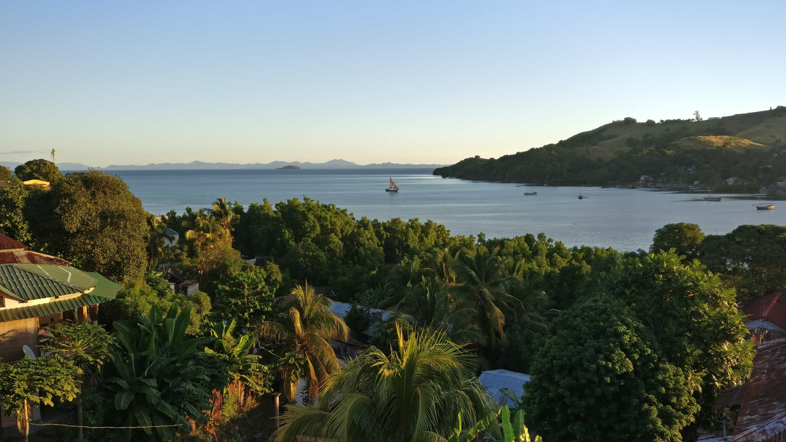

You've probably come to the right place if you want to meet a dedicated developer. I am currently working on 3D graphics projects with my current team in Lille ([PIRVI](http://cristal.univ-lille.fr/pirvi/pages/presentation/)), mainly on our multi-purpose application and 3D engine VAirDraw.

Still attached to my roots of a working-class region in South-Eastern France near Saint-Etienne, I am very grateful towards my present situation. What drives my daily life in computer science is the diversity of tools and languages, as well as the huge community maintaining an almost inexhaustible amount of available resources to use and learn about.